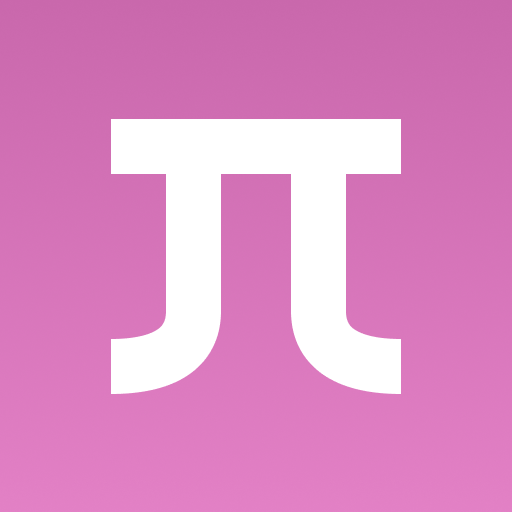

# Embeddium

Embeddium is an unofficial fork of Sodium, with additional changes and bugfixes to integrate it with the Forge modding
ecosystem.

Embeddium is **not supported by CaffeineMC**. Do not report issues encountered with it to their bug tracker or in their
Discord. I have my own [Discord server](https://discord.gg/rN9Y7caguP) for my mods.

## Compatibility

Generally, Embeddium should work out of the box with many more mods than Rubidium. However, given the scope of changes
it makes to the renderer, it may have compatibility issues with some mods that use advanced rendering. Please open an
issue if you experience problems. Some issues may require changes to be made in the other mod but it's good to have
them documented.

**OptiFine is not supported** for obvious reasons.

## Shaders

For now, please continue to use [Oculus](https://www.curseforge.com/minecraft/mc-mods/oculus) if you want shader support.
Note that Oculus is somewhat buggy, and your experience will probably be more stable without it. I recommend removing
Oculus if you do not need shaders.

## Mod integration

If you're looking to add Embeddium to your development environment, please take a look at the [dedicated wiki page](https://github.com/embeddedt/embeddium/wiki/For-Developers).

## Credits

* JellySquid & the CaffeineMC team, for making Sodium in the first place, without which this project would not be possible
* Asek3, for the initial port to Forge
* XFactHD, for providing a list of gamebreaking Rubidium issues to start this work off, and for testing early builds
* Pepper, for their invaluable assistance with getting Forge lighting to work on Sodium 0.5
* @CelestialAbyss and @input-Here for making the new logo design

## License

Embeddium currently follows the license of upstream Sodium (LGPL-3.0).
